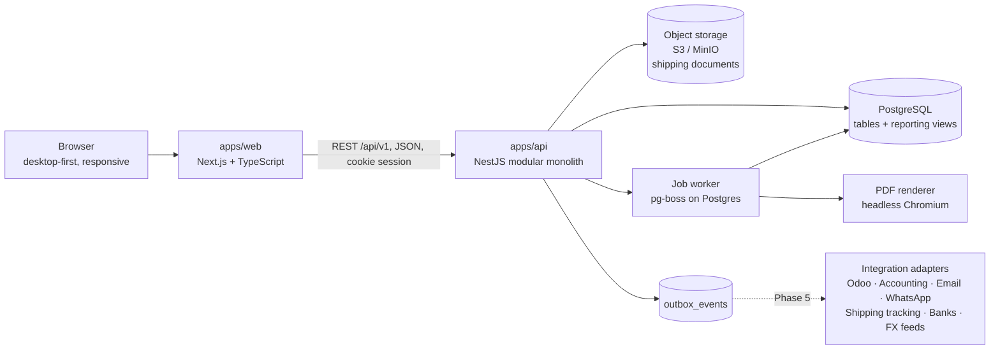

# 01 — System Architecture & Technology Stack

## 1. High-level architecture



**Why a modular monolith.** It's a small team with complex, strongly related data (one
order touches ten tables). One deployable API with clear module boundaries gives
transactional consistency with plain SQL transactions, no distributed-systems overhead,
and a clean path to extract a module later if needed.

**Why a separate API instead of Next.js route handlers only.** Integrations (Odoo, banks,
WhatsApp webhooks, shipping APIs), background jobs and a future AI assistant all need a
stable, documented API that doesn't depend on the web UI.

## 2. Repository layout (pnpm + Turborepo monorepo)

```
fillco/
├─ apps/
│  ├─ web/            Next.js (App Router), React, Tailwind, shadcn/ui, TanStack Table/Query
│  └─ api/            NestJS REST API + worker entrypoint (same codebase, two processes)
├─ packages/
│  ├─ domain/         Pure TypeScript business logic (money, FX, terms, aging, credit, costing, profit)
│  ├─ contracts/      Zod schemas for every request/response → shared types + OpenAPI
│  ├─ db/             Prisma schema, SQL migrations, SQL views, triggers, seed/demo data
│  └─ config/         Shared tsconfig, eslint, prettier
├─ e2e/               Playwright end-to-end tests
├─ docs/design/       This design
└─ docker-compose.yml Postgres, MinIO, Mailpit for local development
```

## 3. API module boundaries (bounded contexts)

| Module | Owns |
|---|---|
| `identity` | users, roles, permissions, sessions, password/MFA |
| `platform` | companies, audit log, timeline events, document numbering, outbox, files, global search |
| `masterdata` | currencies, exchange rates, countries, ports, incoterms, payment terms, bank accounts, warehouses |
| `parties` | customers, suppliers (incl. service providers), contacts, addresses, supplier bank details |
| `catalog` | product categories, attribute definitions, products, variants (specs), units, packaging |
| `sales` | quotations, sales orders, credit control and overrides |
| `purchasing` | purchase orders, SO↔PO allocations, production milestones |
| `logistics` | shipments, containers, shipment events, documents & requirements, inventory |
| `billing` | customer invoices, credit/debit notes, supplier invoices, installments |
| `treasury` | customer & supplier payments, allocations, other cash movements, cash forecast |
| `costing` | cost types, cost entries (estimate/actual), cost allocation, profitability |
| `workflow` | tasks, alert rules & alerts, communication templates & log |
| `reporting` | report queries over views, Excel/PDF export |

**Layering inside each module**

```
controller  → HTTP only: parse/validate with Zod contracts, map errors
service     → use cases: permission checks, DB transaction, audit + timeline + outbox writes
domain      → pure calculations from @fillco/domain (no I/O)
repository  → Prisma / SQL access
```

Rule: writes to another module's tables go through that module's service. Reads
across modules for reporting go through SQL views.

## 4. Technology stack

| Concern | Choice | Reason |
|---|---|---|
| Language | TypeScript (strict) everywhere | One language, shared types |
| Web | Next.js (App Router), React, Tailwind CSS, shadcn/ui | Modern, fast, accessible components |
| Tables/data | TanStack Table + TanStack Query | Powerful filter/sort/pagination, caching |
| Forms | React Hook Form + Zod (same schemas as the API) | One validation source |
| Charts | Recharts | Enough for dashboard KPIs and trends |
| API | NestJS | Module system, guards for RBAC, DI, testing support |
| ORM / migrations | Prisma + raw SQL migrations for views/triggers/constraints | Typed access, versioned migrations; SQL where Prisma is weak |
| Database | PostgreSQL 16 (`numeric`, `pg_trgm`, full-text search, JSONB) | Financial correctness, reporting, search |
| Decimal math | `decimal.js` — **never JS floats for money/qty** | Correct rounding |
| Jobs | pg-boss (queue in Postgres) | Alerts, reminders, FX fetch, PDFs, with no Redis |
| Files | S3-compatible storage (MinIO locally), signed URLs | Durable, cheap, secure downloads |
| PDF | HTML templates → headless Chromium | Invoices/reports look identical to screen |
| Excel | ExcelJS | Real `.xlsx` with typed number/date cells |
| Auth | Own session auth: argon2id hashes, httpOnly cookies, CSRF token, optional TOTP | Simple, secure, no vendor lock-in |
| Tests | Vitest (domain + API integration with Testcontainers Postgres), Playwright (E2E) | Fast and realistic |
| Observability | pino structured logs, Sentry, `/health` endpoints | Production-grade diagnostics |
| CI | GitHub Actions: lint, typecheck, unit, integration, E2E, migration check | Every push verified |
| Deploy | Docker images; VPS or PaaS + managed Postgres with PITR backups | Low ops, recoverable |

## 5. Cross-cutting conventions

### 5.1 Identifiers and numbering
- Primary keys: UUID v7 (time-ordered). Human document numbers are separate unique columns.
- Numbers come from `document_sequences` (per company, document type and year) under a row lock,
  so there are no gaps. A financial document gets its number when it is **posted**; drafts
  show `DRAFT`. Example: `SO-2026-00125`.

### 5.2 Money, quantities, dates
- Money: `numeric(18,4)` in the database, `Decimal` in code, **strings** in JSON.
  Rounded to the currency's minor units (from `currencies.minor_units`) at line level,
  half-up.
- FX rates: `numeric(20,10)`, expressed as *base-currency units per 1 unit of transaction
  currency*.
- Quantities: `numeric(18,4)` in the line's unit, plus `qty_base` in the product base unit (KG).
- Business dates (order, invoice, due, BL): `date`. Events: `timestamptz`.
  "Today" for aging is evaluated in the company timezone.

### 5.3 Row metadata and concurrency
Every table has `created_at, created_by, updated_at, updated_by`. Mutable tables have
`version int` for optimistic locking. The API rejects stale updates with `409 Conflict`.
Quantity allocations use `SELECT … FOR UPDATE` on the parent lines to prevent
over-allocation races.

### 5.4 API conventions
- REST under `/api/v1`. OpenAPI spec generated from Zod contracts.
- List endpoints share one query grammar: `?q=…&filter[status]=CONFIRMED&filter[customerId]=…&sort=-orderDate&page=1&pageSize=50`.
- **State changes are explicit commands**, not generic PATCHes of a status field:
  `POST /sales-orders/{id}/confirm`, `/cancel`, `/invoices/{id}/post`, `/payments/{id}/void`.
- `Idempotency-Key` header on payment and posting commands.
- Errors use RFC 7807 `application/problem+json` with field-level validation details.

### 5.5 Audit, timeline, outbox
In the **same DB transaction** as each business write, the service writes:
1. `audit_logs`: who, when, entity, action, before/after diff, reason (required for overrides/voids).
2. `activity_events`: business timeline entries ("Order confirmed", "BL issued"), keyed to the
   related sales order / shipment so the Order 360 timeline is one query.
3. `outbox_events`: domain events for future integrations (Odoo, email, WhatsApp). A worker
   delivers them later, so integrations never block the user.

### 5.6 Deletion policy
- Master data: **archive** (status `INACTIVE`), never delete when referenced.
- Drafts: can be deleted (audited).
- Posted financial records: **never deleted, never edited**. Cancel via reversal document.
  Enforced by DB triggers, and the application DB role has no `DELETE` on financial tables.

### 5.7 Security
- argon2id password hashing, login rate limiting, session rotation, optional TOTP MFA.
- Authorization in API guards (permission codes), plus field-level filtering of cost/margin data.
- Documents are served only through short-lived signed URLs after a permission check.
  Uploads are checked for type and size and hashed with SHA-256.
- Secrets only via environment variables. Daily encrypted backups with point-in-time recovery.

## 6. Integration readiness (built in, used in Phase 5)
- `outbox_events` gives reliable, ordered event delivery to external systems.
- `external_references(entity_type, entity_id, system, external_id)` maps our records to
  Odoo/accounting IDs without polluting core tables.
- `communication_templates` + `communications` log, with channel adapters (email, WhatsApp, SMS)
  plugged in later.
- `shipment_events.source` (`MANUAL` | `API`) supports automatic tracking from carrier or
  aggregator APIs later.
- `exchange_rates.source` supports automatic rate feeds (e.g. central bank / ECB) later.

## 7. AI readiness (no AI in v1)
- A normalized schema with no duplicated financial truth.
- A documented **semantic layer** of read-only SQL views with stable column names and
  definitions (see [02 — Data model §7](02-data-model.md#7-reporting-views-semantic-layer)).
- A future assistant gets a read-only DB role on those views only, respecting the same
  permission rules. Questions like *"Which customers are >30 days overdue?"* map directly
  to `v_ar_open_items WHERE days_overdue > 30`.
