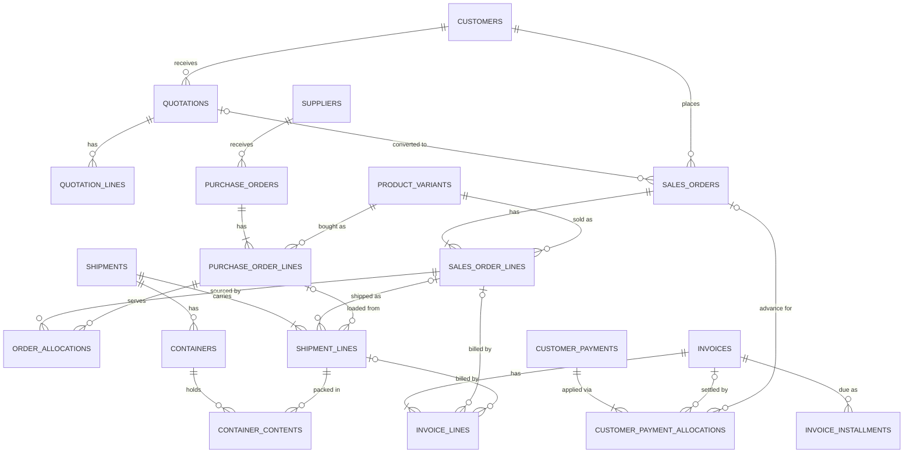
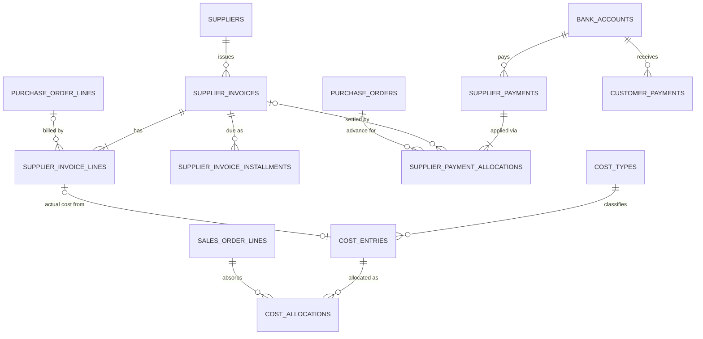
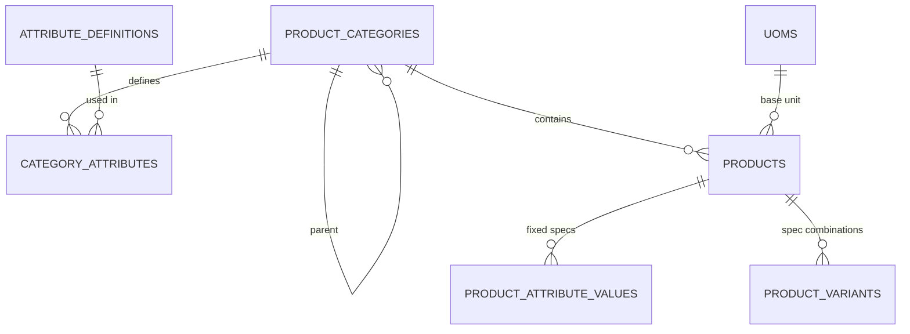

# 02 — Data Model / Entity Relationships

Conventions (see [01 §5](01-architecture.md#5-cross-cutting-conventions)): UUID PKs, `company_id`
on transactional tables, audit columns, `version` for optimistic locking, `numeric` money,
posted financial rows immutable.

**The monetary quartet.** Every financial header carries
`currency_code`, `fx_rate` (base per 1 unit), and totals in both transaction currency and
base currency (`grand_total`, `grand_total_base`). Lines are in the document currency.
Cross-currency allocations store both sides.

---

## 1. Core deal-chain ERD

## 2. Supplier-side & cost ERD

## 3. Catalog ERD (flexible specifications)

---

## 4. Tables by domain

### 4.1 Identity & platform

| Table | Purpose | Key columns |
|---|---|---|
| `companies` | Legal entity (one in v1) | name, legal_name, tax_id, address, **base_currency** (locked after first posting), timezone, logo_file_id, invoice_footer, default_bank_account_id |
| `users` | People who log in | email (unique), full_name, password_hash, is_active, mfa_secret, last_login_at, default_company_id |
| `roles` | Admin, Management, Sales, Purchasing, Logistics, Finance, Viewer (+custom) | code, name, is_system |
| `permissions` | Atomic rights, e.g. `sales_order.create`, `finance.view_costs` | code, description |
| `role_permissions`, `user_roles` | M:N joins | — |
| `user_scopes` | Optional row-level scope (e.g. salesperson sees only own customers) | user_id, scope_type, scope_value |
| `sessions` | Server-side sessions | user_id, token_hash, expires_at, ip, user_agent |
| `document_sequences` | Gapless numbering | company_id, doc_type, year, prefix, next_value |
| `audit_logs` | Immutable change history | occurred_at, user_id, entity_type, entity_id, action, changes jsonb (before/after), reason, request_id, ip |
| `activity_events` | Business timeline | occurred_at, event_type, entity_type, entity_id, **sales_order_id**, **shipment_id**, purchase_order_id, summary, payload jsonb, user_id |
| `outbox_events` | Integration events | event_type, aggregate_type, aggregate_id, payload, status, attempts, available_at |
| `external_references` | IDs in other systems | entity_type, entity_id, system (`ODOO`…), external_id |
| `files` | Stored blobs | storage_key, filename, mime_type, size_bytes, sha256, uploaded_by |

### 4.2 Master data

| Table | Purpose | Key columns |
|---|---|---|
| `currencies` | ISO currencies | code (USD, EUR, TRY, CNY, EGP, SAR, AED…), name, minor_units, symbol, is_active |
| `exchange_rates` | Historical rates | rate_date, from_currency, to_currency, rate, source (`MANUAL`, `ECB`, `TCMB`…); unique(rate_date, from, to, source) |
| `countries` | ISO countries | iso2, name, region |
| `ports` | Ports / places (UN/LOCODE) | locode (e.g. `TRMER`, `CNSHA`, `EGALY`), name, country_iso2, type (SEA/AIR/LAND) |
| `incoterms` | Incoterms 2020 | code, name, seller_pays_main_carriage, seller_pays_insurance, risk_transfer_point |
| `payment_terms` | Named term templates | code, name, description, is_active |
| `payment_term_installments` | Event-based schedule rows | payment_term_id, seq, percent, **trigger_event** (`ORDER_CONFIRMATION`, `BEFORE_LOADING`, `INVOICE_DATE`, `BL_DATE`, `ETA`, `ARRIVAL`, `DELIVERY`), offset_days, instrument (`TT`, `CAD`, `LC`, `CASH`) |
| `bank_accounts` | Company bank accounts | company_id, bank_name, account_name, iban, swift, currency_code, opening_balance, opening_date, is_active |
| `warehouses` | Physical/third-party/bonded | code, name, country, city, type (`OWN`, `THIRD_PARTY`, `BONDED`) |
| `cost_types` | Extensible cost list | code (PRODUCT, FREIGHT, INSURANCE, BANK_CHARGES, CUSTOMS, PORT, INLAND_TRANSPORT, COMMISSION, INSPECTION, DOCUMENTATION, STORAGE, DEMURRAGE, OTHER), default_allocation_method, affects_gross_profit |
| `document_types` | Extensible doc list | code (COMMERCIAL_INVOICE, PACKING_LIST, BL, COO, COA, INSURANCE, CUSTOMS, PURCHASE_INVOICE, ACID, OTHER…), name |
| `document_requirements` | Required-doc checklist rules | document_type, country_iso2 (nullable), customer_id (nullable), incoterm (nullable), required_at_stage (`BEFORE_LOADING`, `AFTER_BL`, `BEFORE_ARRIVAL`) |

### 4.3 Parties

| Table | Purpose | Key columns |
|---|---|---|
| `customers` | Buyers | code (`C-00042`), company_name, country_iso2, city, address, website, tax_id, vat_no, default_currency, payment_term_id, **credit_limit**, credit_limit_currency, default_incoterm, default_destination_port_id, salesperson_id, status (`PROSPECT`, `ACTIVE`, `ON_HOLD`, `BLOCKED`, `INACTIVE`), notes |
| `customer_contacts` | Multiple contacts | customer_id, name, position, phone, email, whatsapp, is_primary |
| `customer_addresses` | Billing / shipping / notify party | customer_id, type, address lines, city, country, is_default |
| `suppliers` | Material suppliers **and** service providers | code (`S-00017`), company_name, **supplier_type** (`MATERIAL`, `FORWARDER`, `SHIPPING_LINE`, `CUSTOMS_BROKER`, `INSURER`, `INSPECTION`, `AGENT`, `OTHER`), country, city, address, default_currency, payment_term_id, production_lead_time_days, default_incoterm, default_loading_port_id, status, notes |
| `supplier_contacts`, `supplier_addresses` | Same pattern as customers | — |
| `supplier_bank_accounts` | Beneficiary details | supplier_id, bank_name, iban/account_no, swift, currency, **status** (`PENDING_APPROVAL`, `APPROVED`, `REVOKED`), approved_by, approved_at |

### 4.4 Catalog

| Table | Purpose | Key columns |
|---|---|---|
| `product_categories` | Tree: Fiber › PSF › HCS | parent_id, code, name |
| `attribute_definitions` | Spec fields defined as data | code (`denier`, `cut_length_mm`, `color`, `siliconized`, `hollow`, `low_melt_pct`, `grade`, `finish`, `yarn_count`, `ply`…), label, data_type (`NUMBER`, `TEXT`, `BOOLEAN`, `ENUM`), unit, options jsonb, min/max |
| `category_attributes` | Which attributes apply to a category | category_id, attribute_id, is_required, **is_variant_defining**, sort_order, default_value |
| `products` | Base product | code, name (e.g. "PSF HCS"), category_id, base_uom (`KG`), default_sales_uom (`MT`), hs_code, country_of_origin, default_purchase_currency, default_sales_currency, is_active, notes |
| `product_attribute_values` | Specs fixed for the whole product | product_id, attribute_id, value |
| `product_variants` | A concrete spec combination (the "SKU") | product_id, sku, **attributes jsonb** (normalized, validated against definitions), **spec_hash** (unique per product), display_name ("PSF HCS 7D × 64mm Siliconized Hollow White") |
| `uoms`, `uom_conversions` | KG, MT, LB, BALE, CONE; product-specific conversions | from_uom, to_uom, factor, product_id nullable |
| `packaging_types` | Bales, cartons, pallets, bobbins | code, name, nominal_weight_kg |

**Why variants?** Specs differ per order. The variant is created on demand the first time a spec
combination is used, then reused. Inventory, pricing history and "profit by product" work at
product *or* variant level. New attributes (e.g. `tenacity`, `crimp`) are added as data,
with no code change or migration.

### 4.5 Sales

| Table | Purpose | Key columns |
|---|---|---|
| `quotations` | Offers with revision history | number, **revision**, parent_quotation_id, customer_id, quotation_date, valid_until, currency, incoterm, destination_port_id, payment_term_id, est_shipment_date, status (`DRAFT`, `SENT`, `ACCEPTED`, `REJECTED`, `EXPIRED`, `SUPERSEDED`, `CONVERTED`), notes |
| `quotation_lines` | | variant_id, description, qty, uom, unit_price, discount_pct, packaging_type_id, line_total, est_unit_cost (for margin preview) |
| `sales_orders` | Customer orders | number, company_id, customer_id, quotation_id, customer_po_ref, order_date, salesperson_id, currency, fx_rate, incoterm, loading_port_id, destination_country, destination_port_id, shipping_address_id, billing_address_id, payment_term_id, requested_shipment_date, **commercial_status** (`DRAFT`, `PENDING_CONFIRMATION`, `CONFIRMED`, `ON_HOLD`, `CLOSED`, `CANCELLED`), confirmed_at, closed_at, cancel_reason, notes |
| `sales_order_lines` | | line_no, variant_id, description + **spec_snapshot jsonb**, packaging_type_id, qty, uom, qty_base, unit_price, discount_pct, line_total, tolerance_pct (e.g. ±5%), line_status (`OPEN`, `CLOSED_SHORT`, `CANCELLED`) |
| `sales_order_payment_schedule` | Snapshot of the term at confirmation (drives pre-invoice advances and cash forecast) | sales_order_id, seq, percent, amount, trigger_event, offset_days, instrument |
| `credit_checks` | Result of every credit evaluation | sales_order_id, customer_id, evaluated_at, limit, open_ar, open_orders, unapplied_credit, exposure, new_order_value, available_after, overdue_amount, result (`PASS`, `WARN`, `BLOCK`) |
| `credit_overrides` | Authorized exceptions | credit_check_id, requested_by, approved_by, approved_at, reason, excess_amount |

### 4.6 Purchasing

| Table | Purpose | Key columns |
|---|---|---|
| `purchase_orders` | Supplier orders | number, supplier_id, supplier_ref (supplier PI no.), po_date, currency, fx_rate, incoterm, loading_port_id, payment_term_id, expected_ready_date, confirmed_ready_date, status (`DRAFT`, `SENT`, `CONFIRMED`, `IN_PRODUCTION`, `READY`, `CLOSED`, `CANCELLED`), notes |
| `purchase_order_lines` | | line_no, variant_id, spec_snapshot, qty, uom, qty_base, unit_price, line_total, expected_ready_date, line_status |
| `order_allocations` | **SO line ↔ PO line (M:N)** | sales_order_line_id, purchase_order_line_id, qty_base, is_substitute (spec differs, needs approval), created_by |
| `purchase_order_payment_schedule` | Supplier advance/balance plan | purchase_order_id, seq, percent, amount, trigger_event, offset_days |
| `purchase_order_milestones` | Production tracking | purchase_order_id, milestone (`PRODUCTION_STARTED`, `PRODUCTION_DONE`, `INSPECTION`, `READY`), planned_date, actual_date |

Constraints: Σ allocations per SO line ≤ qty_base × (1 + tolerance). Σ per PO line ≤ PO qty_base.
A PO line with no allocations is **stock purchase**. An SO line may be allocated from several POs
and suppliers, and one PO line may serve several SO lines.

### 4.7 Logistics & documents

| Table | Purpose | Key columns |
|---|---|---|
| `shipments` | A movement of goods | number, **type** (`DIRECT` supplier→customer, `INBOUND` supplier→warehouse, `OUTBOUND` warehouse→customer), **transport_mode** (`SEA`, `ROAD`, `AIR`, `RAIL`), status, customer_id (nullable), forwarder_id, carrier_id (suppliers), booking_no, **transport_doc_no** (BL/CMR/AWB), transport_doc_type, bl_type (`ORIGINAL`, `SEAWAY`, `TELEX_RELEASE`), **bl_date**, vessel, voyage, origin_country, loading_port_id, discharge_port_id, final_destination, incoterm, **etd, eta, atd, ata**, delivered_at, free_time_days, notes |
| `shipment_lines` | What is shipped | shipment_id, sales_order_line_id (nullable for inbound), purchase_order_line_id (nullable for outbound-from-stock), variant_id, lot_id, **qty_base** (actual loaded), packages, gross_weight_kg, net_weight_kg |
| `containers` | Equipment | shipment_id, container_no (ISO 6346 check-digit validated), container_type (`20GP`, `40GP`, `40HC`, `TRUCK`…), seal_no, tare_kg, gross_kg, vgm_kg, status |
| `container_contents` | Packing list rows | container_id, shipment_line_id, qty_base, packages, gross_kg, net_kg |
| `shipment_events` | Status history & tracking | shipment_id, status, occurred_at, location, source (`MANUAL`, `API`), note |
| `documents` | A logical document | document_type, title, reference_no, issue_date, current_version_id, status (`ACTIVE`, `SUPERSEDED`, `VOID`) |
| `document_versions` | Every uploaded version, kept forever | document_id, version_no, file_id, uploaded_by, uploaded_at, change_note |
| `document_links` | One document ↔ many records | document_id, entity_type (`SHIPMENT`, `CONTAINER`, `SALES_ORDER`, `PURCHASE_ORDER`, `INVOICE`, `SUPPLIER_INVOICE`), entity_id |

### 4.8 Inventory

| Table | Purpose | Key columns |
|---|---|---|
| `lots` | Traceable production lots | lot_no, variant_id, supplier_id, purchase_order_line_id, production_date |
| `inventory_movements` | **Immutable ledger** of physical stock | occurred_at, variant_id, lot_id, qty_base (+/−), warehouse_id, container_id, shipment_line_id, reason (`RECEIPT`, `ISSUE`, `ADJUSTMENT`, `TRANSFER`), unit_cost_base, reversal_of_id |
| `inventory_reservations` | Stock reserved for customers | variant_id, lot_id, warehouse_id, sales_order_line_id, qty_base, status |

Pipeline positions are **derived** from documents and never stored twice:
- *Purchased, not yet shipped* = PO line qty − shipped qty (from `shipment_lines`).
- *In transit* = shipment lines on shipments in `LOADED`…`RELEASED`.
- *Physical stock* = Σ `inventory_movements` per warehouse/lot.
- *Customer-allocated* = allocations + reservations. *Available* = physical − reserved.

### 4.9 Billing & treasury

| Table | Purpose | Key columns |
|---|---|---|
| `invoices` | Customer invoices, credit notes, debit notes | number, **doc_type** (`INVOICE`, `CREDIT_NOTE`, `DEBIT_NOTE`), customer_id, sales_order_id (primary), invoice_date, currency, fx_rate, subtotal, discount_total, freight_total, other_charges_total, tax_total, grand_total, grand_total_base, status (`DRAFT`, `POSTED`, `CANCELLED`), reverses_invoice_id, posted_at, posted_by |
| `invoice_lines` | | line_type (`PRODUCT`, `FREIGHT`, `INSURANCE`, `CHARGE`, `DISCOUNT`), sales_order_line_id, shipment_line_id, variant_id, description, qty, uom, unit_price, discount_pct, tax_rate, line_total |
| `invoice_shipments` | Invoice ↔ shipment (M:N, per configuration) | invoice_id, shipment_id |
| `invoice_installments` | Receivable due dates | invoice_id, seq, amount, trigger_event, offset_days, **due_date** (nullable while event pending), **estimated_due_date**, due_status (`FIXED`, `PENDING_EVENT`) |
| `customer_payments` | Money received | number, customer_id, payment_date, value_date, bank_account_id, currency, **gross_amount**, **bank_charges**, **net_received**, fx_rate, gross_amount_base, instrument (`TT`, `LC`, `CAD`, `CHEQUE`, `CASH`), bank_reference, status (`POSTED`, `VOIDED`), void_reason, notes |
| `customer_payment_allocations` | **Payment ↔ invoices / order advances** | customer_payment_id, invoice_id (nullable), sales_order_id (nullable = advance), amount_payment_ccy, amount_invoice_ccy, fx_diff_base, status (`ACTIVE`, `REVERSED`), reversed_by_id |
| `supplier_invoices` | Supplier bills (goods **and** services) | supplier_id, **supplier_invoice_no** (unique per supplier), invoice_date, received_date, currency, fx_rate, totals, status, purchase_order_id, shipment_id |
| `supplier_invoice_lines` | | purchase_order_line_id (goods) or cost_type_id (services), description, qty, unit_price, line_total, cost target (shipment/container/SO/SO line) |
| `supplier_invoice_installments` | Payable due dates | same shape as `invoice_installments` |
| `supplier_payments`, `supplier_payment_allocations` | Mirror of customer side (advances to PO allowed) | supplier_bank_account_id must be `APPROVED` |
| `cash_movements` | Other income/expenses/transfers (rent, salaries later, inter-account transfers) | bank_account_id, date, direction, category, amount, currency, fx_rate, reference |
| `planned_cash_items` | Manual future items for the forecast | date, direction, category, amount, currency, note, related entity |

### 4.10 Costing

| Table | Purpose | Key columns |
|---|---|---|
| `cost_entries` | One cost, estimated or actual | cost_type_id, **nature** (`ESTIMATE`, `ACTUAL`), supplier_id, supplier_invoice_line_id (actuals), currency, amount, fx_rate, amount_base, incurred_date, **target** = exactly one of sales_order_id / sales_order_line_id / shipment_id / container_id / purchase_order_id / customer_id / supplier_id (CHECK constraint), allocation_method (`QUANTITY`, `WEIGHT`, `VALUE`, `PER_CONTAINER`, `MANUAL`), status (`ACTIVE`, `SUPERSEDED`, `REVERSED`), description |
| `cost_allocations` | Result of spreading a cost to SO lines | cost_entry_id, sales_order_line_id, amount_base, basis_value, computed_at |
| `cost_templates` | Auto-estimates at confirmation | cost_type_id, incoterm, route (loading/discharge port), per_container / per_ton / percent_of_value, currency, amount |
| `order_profit_snapshots` | Frozen actuals when an order is closed | sales_order_id, snapshot jsonb, closed_at, closed_by |

Customer- or supplier-level costs (e.g. an annual agent retainer) are **period costs**: shown in
customer/supplier profitability but not pushed into order gross profit unless the user allocates them.

### 4.11 Workflow

| Table | Purpose | Key columns |
|---|---|---|
| `tasks` | Follow-ups | title, task_type (`CALL`, `SEND_QUOTATION`, `FOLLOW_UP_PAYMENT`, `CONFIRM_PRODUCTION`, `CHECK_VESSEL`, `REQUEST_BL`, `REQUEST_COO`, `PAY_SUPPLIER`, `SEND_DOCUMENTS`, `OTHER`), assigned_to, due_date, priority, status, customer_id, supplier_id, sales_order_id, purchase_order_id, shipment_id, invoice_id, source (`MANUAL`, `ALERT`), completed_at, notes |
| `alert_rules` | Configurable rules | code, params jsonb (e.g. `{"days_before":7}`), severity, notify_roles, is_enabled |
| `alerts` | Detected conditions | rule_code, entity_type, entity_id, severity, message, **dedupe_key** (unique while open), detected_at, acknowledged_by, resolved_at |
| `communication_templates` | Message templates | code (`ORDER_CONFIRMATION`, `PAYMENT_REMINDER`, `SHIPMENT_UPDATE`, `DOCS_READY`, `INVOICE_ISSUED`, `OVERDUE_REMINDER`), channel, language, subject, body (placeholders `{{invoice.number}}`) |
| `communications` | Log of drafted/sent messages | template_id, channel, recipient, entity refs, rendered_body, status, sent_at |

---

## 5. Key integrity constraints (enforced in the database)

- `CHECK` on exactly one cost target. `CHECK` qty > 0, amounts ≥ 0 (sign handled by doc type).
- Unique: `(supplier_id, supplier_invoice_no)`, `(company_id, doc_type, number)`, `(product_id, spec_hash)`.
- Triggers: reject `UPDATE`/`DELETE` of `POSTED` invoices, supplier invoices, payments, allocations
  and inventory movements, except the whitelisted status transition to `CANCELLED`/`VOIDED` via
  the service, which records a reversal.
- Allocation caps (SO line, PO line, payment amount, invoice outstanding) are checked in the
  service under row locks and re-verified by deferred constraint triggers.
- `companies.base_currency` cannot change once any posted financial record exists.

## 6. Indexing & search

- B-tree on all FKs, status and date columns used by lists (order_date, due_date, eta).
- `pg_trgm` GIN indexes on names, document numbers, container numbers, BL numbers, phones, emails.
- A `v_search_index` view (entity_type, entity_id, title, subtitle, search_text) powers global search.

---

## 7. Reporting views (semantic layer)

Every report, dashboard tile and future AI question reads from these. Each view is documented
column-by-column in code comments (`COMMENT ON VIEW/COLUMN`).

| View | One row per | Answers |
|---|---|---|
| `v_so_line_fulfillment` | SO line | ordered, allocated (purchased), shipped, delivered, invoiced qty; remaining to purchase/ship/invoice |
| `v_sales_order_status` | SO | derived purchasing / shipping / invoicing / payment status + display status |
| `v_shipment_overview` | shipment | customer(s), supplier(s), SOs, POs, containers, ETD/ETA, delay days, docs missing, invoice & payment status, profit |
| `v_ar_open_items` | invoice installment | amount, paid, outstanding, due_date, days_to_due, days_overdue, aging_bucket, ar_status |
| `v_ap_open_items` | supplier installment | same for payables |
| `v_customer_exposure` | customer | limit, open AR, overdue, not due, open order value, pending shipments, unapplied credit, exposure, available |
| `v_order_profitability` | SO (and SO line) | revenue & costs estimated vs actual by cost type, profit, margin, collected, outstanding, supplier paid/outstanding, cash invested/recovered/tied up |
| `v_cash_forecast` | expected cash item | date (actual or estimated), direction, category, amount_base, certainty (`FIXED`, `ESTIMATED`, `OVERDUE`) |
| `v_pipeline_inventory` | variant × stage × location | purchased-not-shipped, in transit, in stock, reserved, available, value at cost |
