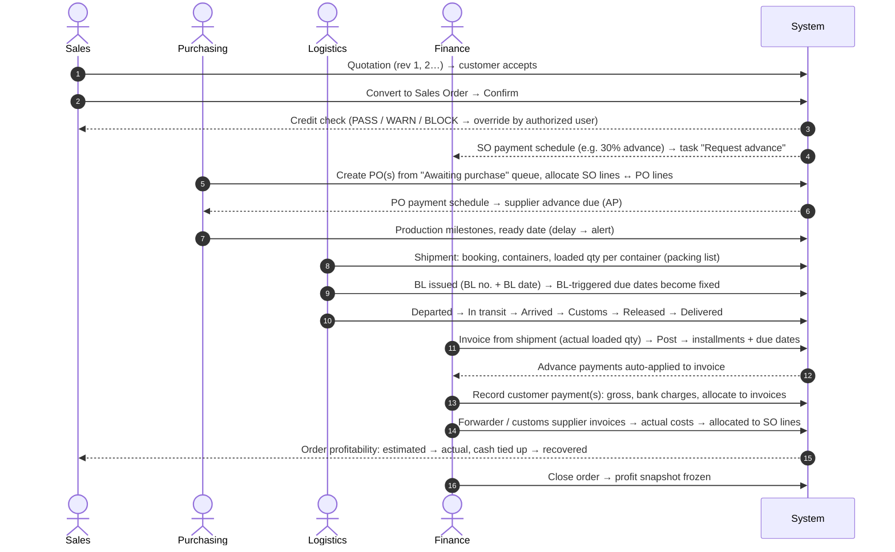

# 03 — Main Workflows

## 1. End-to-end deal flow (back-to-back, direct shipment)

## 2. Quotation → Sales Order
1. Create a quotation for a customer. Lines pick a **product**, then fill the category's spec
   attributes (denier, cut length, siliconized…). The system finds or creates the variant.
2. Optionally enter an estimated unit cost for a margin preview (visible only with `finance.view_costs`).
3. Send (PDF/email template). Any edit after sending creates **revision n+1**, and the old one
   becomes `SUPERSEDED`. The full history is kept.
4. The quotation expires automatically after `valid_until`.
5. **Convert** copies header and lines into a `DRAFT` sales order linked to the quotation.
   The quotation becomes `CONVERTED`.

## 3. Sales Order confirmation & credit control
1. Draft → `PENDING_CONFIRMATION` (sent as order confirmation / proforma invoice) → **Confirm**.
2. On confirm the system runs a credit check (formula in [06 §4](06-business-rules.md#4-customer-credit-control)):
   - `PASS`: confirmed.
   - `WARN`: exposure > limit. Confirmation is blocked for normal users. A user with
     `credit.override` confirms with a **mandatory reason**. A `credit_overrides` row and an
     audit entry are written.
   - `BLOCK`: customer `BLOCKED`/`ON_HOLD`, or overdue beyond the configured threshold. Only
     Management/Admin can override.
3. The payment term is **snapshotted** into `sales_order_payment_schedule`. Later changes
   to the customer's default term don't rewrite confirmed orders.
4. Cost estimates are generated from `cost_templates` (freight per container on the route,
   insurance % for CIF, bank charges, commission). All are editable.
5. Tasks are created: "Request advance payment" (if an advance installment exists), "Create PO".

## 4. Purchasing (one SO ↔ many POs, one PO ↔ many SOs)
1. **Awaiting purchase** queue = confirmed SO lines with remaining unallocated quantity.
2. Select lines (possibly from different customers, same variant) → **Create PO** for a supplier,
   or **allocate** to an existing open PO line with free quantity.
3. Allocation rules: same variant, or `is_substitute = true` with a note (e.g. a different
   supplier's equivalent grade). Quantities are capped under row locks.
4. PO lifecycle: `DRAFT → SENT → CONFIRMED` (supplier PI number entered) `→ IN_PRODUCTION → READY → CLOSED`.
5. The supplier payment schedule is snapshotted. Supplier advances can be paid **before** any
   supplier invoice exists and are allocated to the PO.
6. Milestones record planned vs actual dates. If `READY` is late against `expected_ready_date`,
   the system raises a *Purchase order delayed* alert.

## 5. Shipment, containers, partial shipments
1. Create a shipment (type `DIRECT` by default) and pick the **PO lines and SO lines** to load.
   The UI proposes quantities from allocations and remaining quantities.
2. Booking requested/confirmed (booking no., forwarder, carrier, vessel/voyage, ETD/ETA).
3. Add containers (ISO 6346 check-digit validated). The packing list assigns shipment-line
   quantities, bales and weights to containers. Totals must reconcile with the shipment lines.
4. **Loaded** fixes the *actual loaded quantity* (often ≠ ordered because of bale weights:
   e.g. ordered 100 MT, loaded 101.36 MT).
5. BL issued: number, type, **BL date** → every `BL_DATE`-triggered installment on related orders
   and invoices gets a real due date.
6. Status events: `BOOKING_REQUESTED → BOOKING_CONFIRMED → CARGO_PREPARING → CARGO_READY → LOADED →
   DEPARTED → IN_TRANSIT → ARRIVED_PORT → CUSTOMS → RELEASED → DELIVERED`. Each event has a date,
   location and source (manual now, tracking API later).
7. A partial shipment leaves the SO line open with the remaining quantity. A second shipment
   ships the rest. The user can **close short** a line (within or outside tolerance, with a reason).

## 6. Shipping documents
1. The **required documents checklist** for each shipment comes from `document_requirements`
   (by destination country, customer, incoterm), e.g. CI, PL, BL, COO, COA, insurance for CIF,
   plus country-specific items.
2. Upload a file to a document. Re-uploading creates version n+1, and old versions stay downloadable.
3. One document can be linked to several records (a BL linked to the shipment, both SOs and the invoice).
4. Missing required documents at a stage raise a *Missing shipping documents* alert.

## 7. Customer invoicing
1. **Invoice from shipment** (default): lines use the *shipped* quantities of that shipment.
   Freight/insurance lines are added for CFR/CIF if invoiced separately.
   Alternatives are configurable: one invoice covering several shipments, or invoice by SO.
2. Draft → **Post**: the number is assigned, the document is locked, the FX rate is stored,
   and installments are generated from the SO schedule snapshot. Advance installments already
   invoiced/received are credited.
3. Existing advances (payments allocated to the SO) are **auto-applied** to the new invoice.
4. Corrections after posting use a **credit note** (full or partial) or a **debit note**, never an edit.
   A full cancel = credit note for 100%, linked to the original.
5. PDF generated from the company template. The "Invoice notification" template is ready to send.

## 8. Customer payments
1. Record the receipt: date, bank account, currency, **gross amount, bank charges, net received**,
   instrument (TT/LC/CAD), reference.
2. Allocate: the system suggests oldest-due-first across the customer's open installments. The user
   can reallocate. One payment → many invoices, and many payments → one invoice.
3. Cross-currency: invoice in USD, receipt in EUR. Store both amounts. The difference in base
   currency is a realized FX gain/loss.
4. Any unallocated remainder stays as **unapplied credit** on the customer. It reduces exposure
   and can be applied later.
5. Bank charges become an actual `BANK_CHARGES` cost entry on the related order(s).
6. Mistakes: **void** the payment (reason required). Allocations are reversed and a record of both
   is kept.

## 9. Supplier invoices & payments (AP)
1. Register the supplier invoice. Duplicate `(supplier, supplier_invoice_no)` is rejected.
2. Goods invoices are matched to PO lines, with warnings if the invoiced qty exceeds received/shipped
   qty or the price differs from the PO.
3. Service invoices (forwarder, customs broker, insurer, inspection) are coded by cost type and
   target (shipment/container/SO). Posting creates **actual** cost entries, which supersede
   the matching estimates.
4. Pay suppliers only to an `APPROVED` bank account. Allocate to invoices or to PO advances.

## 10. Cost allocation & profit
1. Cost entries sit at a target level (container, shipment, SO, SO line, PO).
2. Allocation spreads them to **SO lines** by the entry's method (quantity, weight, value,
   per container, manual). It is re-run automatically when shipments or quantities change,
   until the order is closed.
3. Product cost = allocated PO line quantity × PO unit price (converted), replaced by the supplier
   invoice price once posted.
4. Profit views compare estimated vs actual per cost type (formulas in [06 §6](06-business-rules.md#6-profit)).

## 11. Closing an order
An order can be closed when all lines are shipped or closed short, fully invoiced, and all
expected actual costs are recorded (the system warns about cost types that still have only
estimates). Closing freezes an `order_profit_snapshot`. Receivables stay open until collected;
the payment status continues independently.

## 12. Cancellation & reversal
| Record | How it is undone |
|---|---|
| Draft anything | Delete (audited) |
| Confirmed SO / PO without downstream records | Cancel with reason; allocations released |
| SO / PO with shipments or invoices | Cancel remaining lines only ("close short") |
| Posted invoice | Credit note (links to original) |
| Posted payment | Void → reversal of allocations |
| Inventory movement | Reversal movement |
| Cost entry | Reverse (status `REVERSED`), then re-enter |

## 13. Alerts & tasks (background job, every 15 minutes + nightly)
Each rule computes its set of matches, opens new alerts (by `dedupe_key`), resolves alerts
that no longer match, and optionally creates a task for the responsible role or user.
Rules: payment due in 7 days, payment overdue, credit limit exceeded, supplier payment due,
ETA within N days, shipment delayed (ETA moved later or ATA > ETA), order ready to ship,
order partially shipped, confirmed order not yet purchased after N days, PO delayed,
missing shipping documents, overdue tasks.
